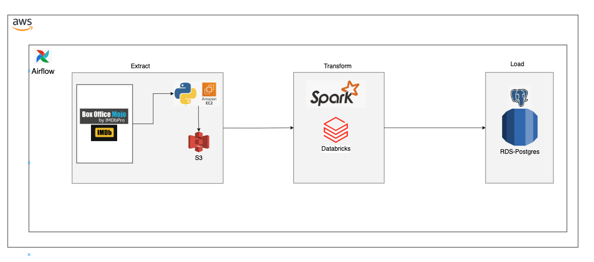
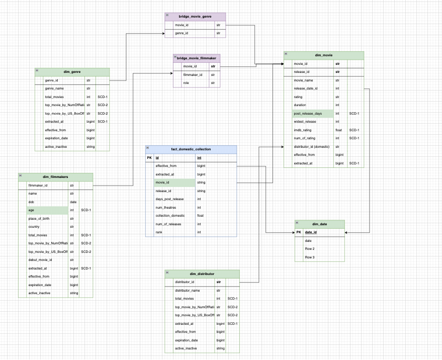

# Movie Data Pipeline

This is an ETL pipeline which scrapes data from the following sites:

1. boxofficemojo.com
2. imdb.com

And loads this data inside a PostgreSQL instance hosted on AWS Relational Database Service (RDS)

Following is the pipeline architecture:

And the following is how the data that gets loaded in the PostgreSQL database is modeled:

