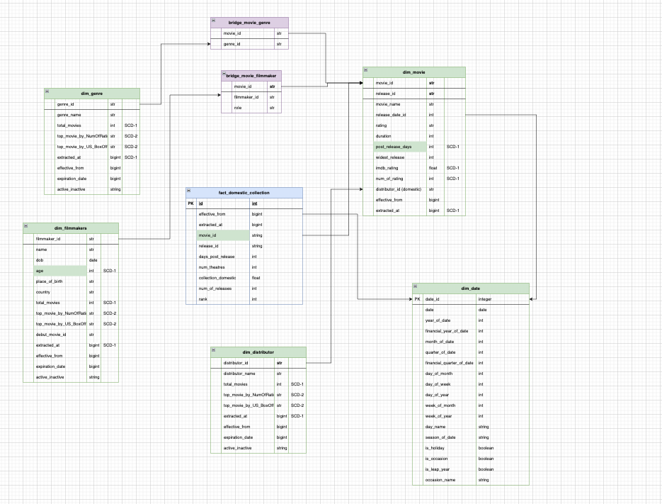

# Movie Data Pipeline

This is an ETL pipeline which scrapes data from the following sites:

1. boxofficemojo.com
2. imdb.com

And loads this data inside a PostgreSQL instance hosted on AWS Relational Database Service (RDS)

Following is the pipeline architecture:

And, the following is the data model where the data will be loaded (click the image to open the link):

